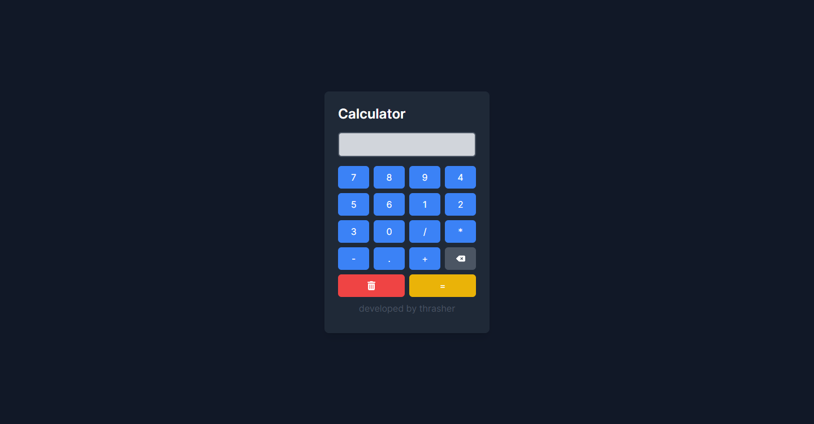

 

  <h3 align="center">Calculator Nextjs</h3>

  

    An Awesome Calculator with Nextjs!
     
     
  

    

## About The Project

I did some research, but I couldn't find a properly built calculator with Next.js, so I decided to develop one to improve my skills with Next.js. I also wanted to upload the files to my GitHub account. I hope you like it. <3

## Built With

- Next.js
- Tailwindcss
- Javascript

## Getting Started

Fork the project and download with git edit, use, change whatever you want.

### Installation

1. npm install
2. npm run dev

easy peasy lemon squeezy

## Contributing

Contributions are what make the open source community such an amazing place to be learn, inspire, and create. Any contributions you make are **greatly appreciated**.
* If you have suggestions for adding or removing projects, feel free to [open an issue](https://github.com/thrashxr/calculator-next/issues/new) to discuss it, or directly create a pull request after you edit the *README.md* file with necessary changes.
* Please make sure you check your spelling and grammar.
* Create individual PR for each suggestion.

### Creating A Pull Request

1. Fork the Project
2. Create your Feature Branch (`git checkout -b feature/AmazingFeature`)
3. Commit your Changes (`git commit -m 'Add some AmazingFeature'`)
4. Push to the Branch (`git push origin feature/AmazingFeature`)
5. Open a Pull Request

## License

Distributed under the MIT License. See [LICENSE](https://github.com/thrashxr/calculator-next/blob/main/LICENSE.md) for more information.

## Authors

* **Thrasher** - [Thrasher](https://thrasher.fun)
